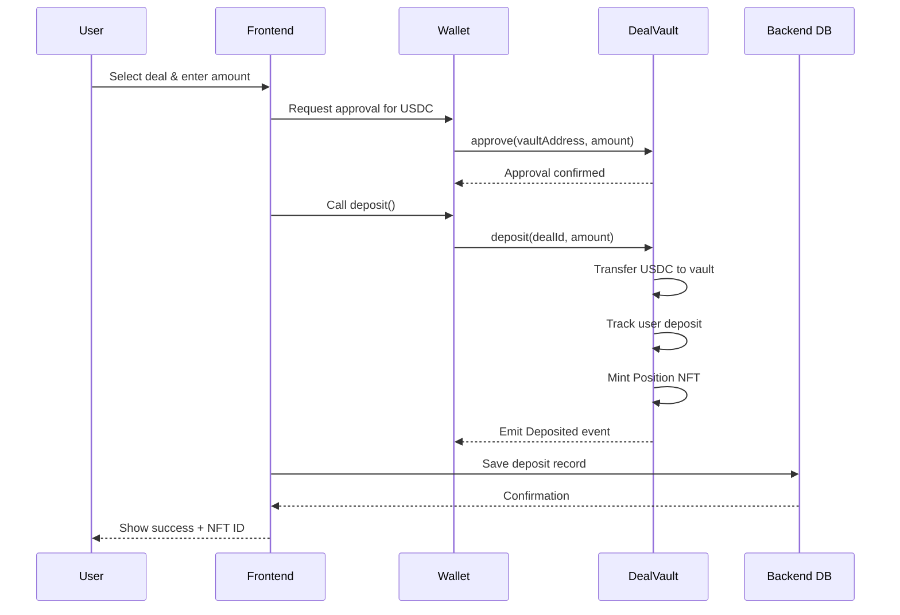
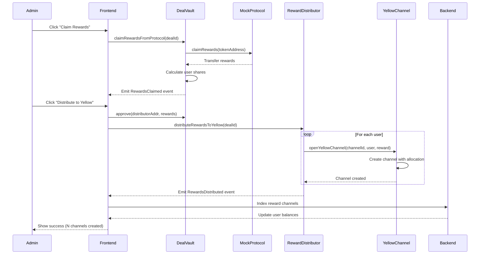
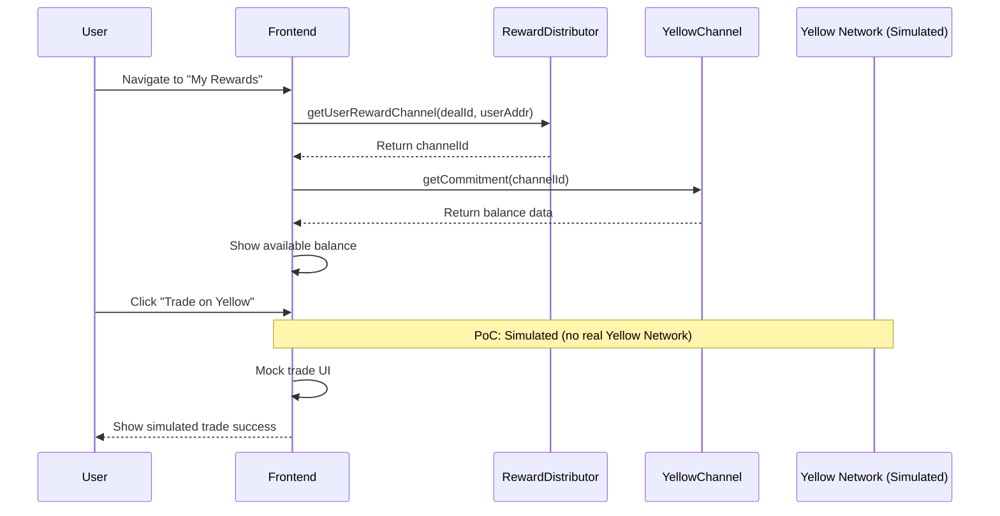

# Liquium Full-Stack Implementation Guide

## 📊 System Architecture

```
┌─────────────────────────────────────────────────────────────────┐
│                         FRONTEND (React)                        │
│  ┌──────────┐  ┌──────────┐  ┌──────────┐  ┌──────────┐      │
│  │ Connect  │  │  Deal    │  │  Deposit │  │  Rewards │      │
│  │  Wallet  │  │  List    │  │   Flow   │  │   Page   │      │
│  └────┬─────┘  └────┬─────┘  └────┬─────┘  └────┬─────┘      │
│       │             │              │              │             │
│       └─────────────┴──────────────┴──────────────┘             │
│                          │                                       │
│                    wagmi/viem (Web3)                            │
└──────────────────────────┼──────────────────────────────────────┘
                           │
                           ├──────────────┐
                           │              │
                           ▼              ▼
┌────────────────────────────────┐  ┌─────────────────────────┐
│   BACKEND API (Express)        │  │   SMART CONTRACTS       │
│                                │  │                         │
│  ┌──────────────────────┐     │  │  • DealVault            │
│  │  Deal Service        │     │  │  • MockProtocol         │
│  │  - Create deals      │     │  │  • YellowChannel        │
│  │  - Track deposits    │     │  │  • RewardDistributor    │
│  └──────────────────────┘     │  │                         │
│                                │  │  Base Sepolia Testnet   │
│  ┌──────────────────────┐     │  │  Chain ID: 84532        │
│  │  User Service        │     │  └─────────────────────────┘
│  │  - User profiles     │     │
│  │  - Yellow addresses  │     │
│  └──────────────────────┘     │
│                                │
│  ┌──────────────────────┐     │
│  │  Notification Svc    │     │
│  │  - Event indexing    │     │
│  │  - Webhooks          │     │
│  └──────────────────────┘     │
│                                │
│         PostgreSQL DB          │
└────────────────────────────────┘
```

---

## 🔄 Main User Flows

### Flow 1: User Deposits into Deal



### Flow 2: Claim Rewards & Distribute to Yellow



### Flow 3: User Views Yellow Balance (PoC Demo)



---

## ✅ What's Working vs ⚠️ What's Not

### ✅ FULLY WORKING (Production Ready)

1. **DealVault Contract**
   - ✅ Create deals with parameters
   - ✅ Users can deposit USDC/tokens
   - ✅ Lock deals (prevent new deposits)
   - ✅ Track individual user deposits
   - ✅ User can set Yellow address

2. **MockProtocol Contract**
   - ✅ Accept deposits from DealVault
   - ✅ Calculate 10% simple interest
   - ✅ Return rewards when claimed

3. **User Tracking**
   - ✅ `userDeposits` mapping tracks each user
   - ✅ Proportional reward calculation
   - ✅ getUserDeposit() view function

4. **Position NFTs**
   - ✅ Minted on each deposit
   - ✅ Transferable (can trade on OpenSea)
   - ✅ Contains deposit metadata

### ⚠️ PARTIALLY WORKING (Needs Setup)

1. **MockProtocol Funding**
   - ⚠️ Needs to be funded with tokens BEFORE claiming rewards
   - **Solution**: Admin must call `mockProtocol.fundProtocol(USDC, amount)`
   - **For Demo**: Pre-fund with 10% of expected deposits

2. **YellowRewardDistributor**
   - ⚠️ Requires DealVault to approve it first
   - **Solution**: Admin calls `dealVault.approve(distributorAddr, rewardAmount)`
   - **For Demo**: Can be done in one transaction before distribute

3. **Yellow Channel Creation**
   - ⚠️ Creates channels on-chain ✅
   - ⚠️ No actual Yellow Network connection ❌
   - **For Demo**: Show channel IDs, mock the trading UI

### ❌ NOT IMPLEMENTED (Future Work)

1. **Yellow Network Off-Chain Trading**
   - ❌ Requires Yellow Network infrastructure
   - ❌ WebSocket connection to Yellow nodes
   - ❌ Off-chain state signatures
   - **For Demo**: Mock the UI, show simulated trades

2. **Cross-Chain Deposits**
   - ❌ RemoteVault not implemented
   - ❌ LayerZero integration pending
   - **For Demo**: Skip this feature

3. **Real Price Oracles**
   - ❌ Using MockPriceReader (fixed prices)
   - ❌ Should use Chainlink on Base mainnet
   - **For Demo**: MockPriceReader is fine

---

## 🎯 PoC Demo Strategy

### What to Show

1. **✅ Working Demo Flow**
   ```
   Admin creates deal
   → Users connect wallet & deposit USDC
   → Admin locks deal
   → Admin deposits to MockProtocol
   → Wait / fast-forward time
   → Admin claims rewards (10% appears!)
   → Admin distributes to Yellow channels
   → Users see their reward channels created
   → Show mock Yellow trading UI
   ```

2. **🎨 Mock/Simulate (Frontend Only)**
   - Yellow Network connection (show "Connected" badge)
   - Off-chain trading (show trade confirmations)
   - Real-time balance updates (use local state)

3. **📊 Analytics Dashboard**
   - Total TVL in deals
   - User deposit breakdown
   - Reward distribution stats
   - Channel creation events

### Pre-Demo Setup

```bash
# 1. Deploy test USDC token on Base Sepolia
# 2. Mint USDC to test users
# 3. Fund MockProtocol with 10% of expected deposits
# 4. Create a test deal with short duration (5 min for demo)
# 5. Have 2-3 wallets ready to deposit
```

---

## 🏗️ Tech Stack

### Frontend
- **React 18** with TypeScript
- **wagmi v2** for wallet connection
- **viem** for contract interactions
- **TanStack Query** for data fetching
- **Tailwind CSS** for styling
- **Recharts** for analytics

### Backend
- **Express** with TypeScript
- **PostgreSQL** for database
- **Prisma** ORM
- **ethers.js** for event indexing
- **WebSockets** for real-time updates

### Infrastructure
- **Base Sepolia** testnet
- **Vercel** for frontend hosting
- **Railway/Render** for backend
- **Supabase** for database

---

## 📁 Project Structure

```
liquium/
├── frontend/
│   ├── src/
│   │   ├── components/
│   │   │   ├── DealList.tsx
│   │   │   ├── DepositModal.tsx
│   │   │   ├── RewardsPanel.tsx
│   │   │   └── YellowTrading.tsx (mock)
│   │   ├── hooks/
│   │   │   ├── useDeals.ts
│   │   │   ├── useDeposit.ts
│   │   │   ├── useRewards.ts
│   │   │   └── useYellowChannel.ts (mock)
│   │   ├── lib/
│   │   │   ├── contracts.ts (ABIs + addresses)
│   │   │   ├── wagmi.ts (config)
│   │   │   └── api.ts (backend client)
│   │   ├── pages/
│   │   │   ├── Home.tsx
│   │   │   ├── Deals.tsx
│   │   │   ├── MyPositions.tsx
│   │   │   └── Admin.tsx
│   │   └── App.tsx
│   └── package.json
│
├── backend/
│   ├── src/
│   │   ├── services/
│   │   │   ├── dealService.ts
│   │   │   ├── userService.ts
│   │   │   └── indexer.ts (event indexing)
│   │   ├── routes/
│   │   │   ├── deals.ts
│   │   │   ├── users.ts
│   │   │   └── rewards.ts
│   │   ├── db/
│   │   │   ├── schema.prisma
│   │   │   └── client.ts
│   │   └── index.ts
│   └── package.json
│
└── contracts/ (already exists)
```

---

## 🚀 Next Steps

I'll now create the actual code files:
1. Frontend components and hooks
2. Backend API services
3. Database schema
4. Configuration files
5. Demo scripts

Ready to continue? 🎯
