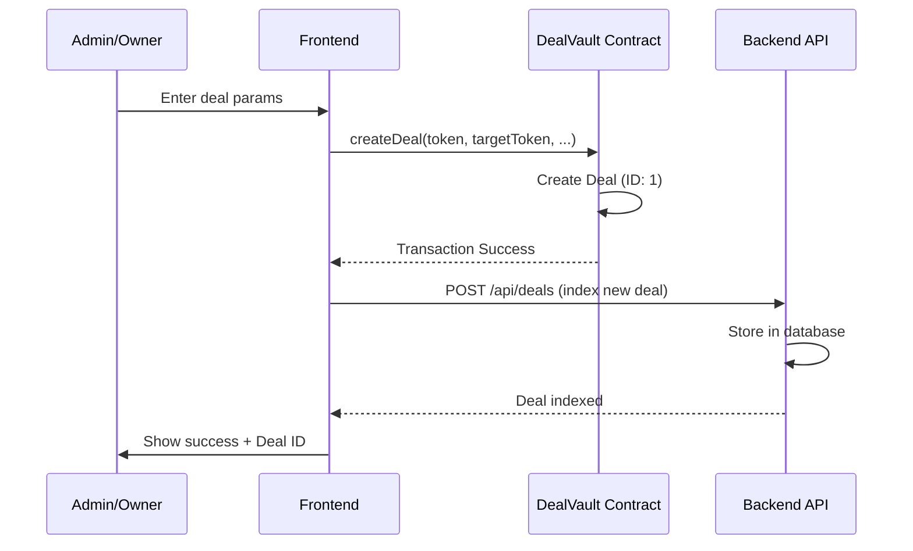
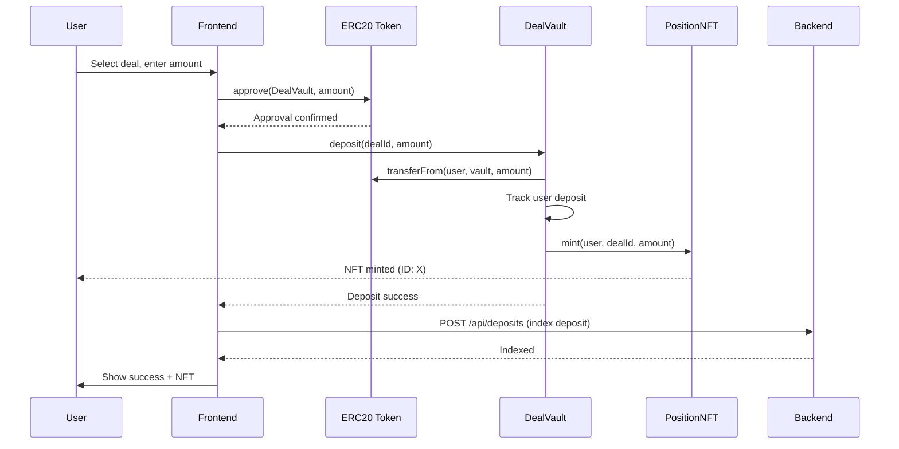
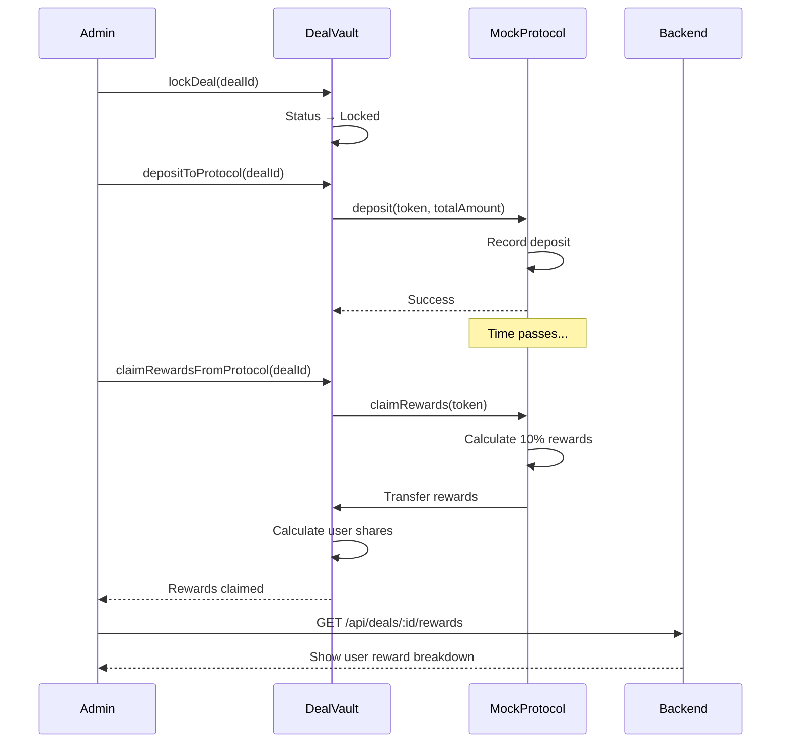
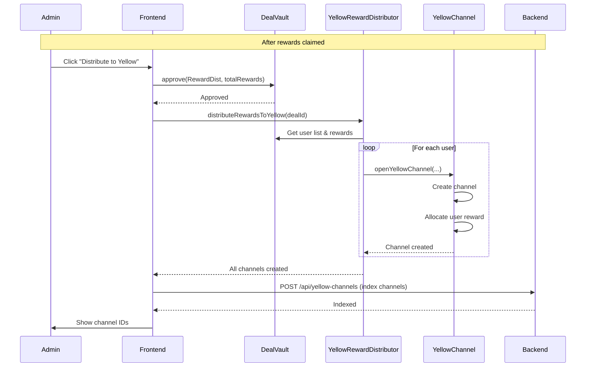
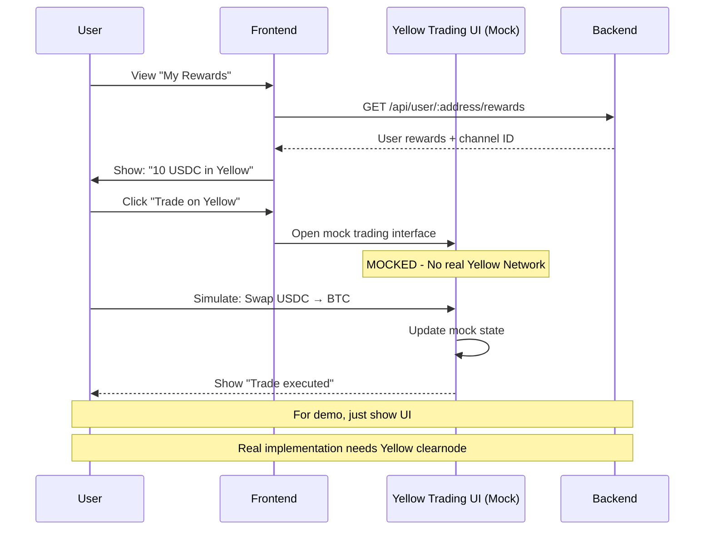

# Liquium Fullstack Implementation Guide

**Complete Frontend + Backend Architecture for PoC Demo**

---

## 📊 Table of Contents

1. [Architecture Overview](#architecture-overview)
2. [What's Working vs Not Working](#whats-working-vs-not-working)
3. [Deployment Summary](#deployment-summary)
4. [Sequence Diagrams](#sequence-diagrams)
5. [Frontend Implementation](#frontend-implementation)
6. [Backend Implementation](#backend-implementation)
7. [PoC Demo Strategy](#poc-demo-strategy)
8. [Project Setup](#project-setup)

---

## Architecture Overview

### System Components

```
┌─────────────────────────────────────────────────────────────────┐
│                     FRONTEND (React + TypeScript)               │
│  ┌──────────────┐  ┌──────────────┐  ┌──────────────┐          │
│  │  Deal List   │  │ Deposit Page │  │ Rewards Page │          │
│  │  Component   │  │   Component  │  │   Component  │          │
│  └──────────────┘  └──────────────┘  └──────────────┘          │
│         │                  │                  │                 │
│         └──────────────────┴──────────────────┘                 │
│                            │                                    │
│                   ┌────────▼─────────┐                          │
│                   │  wagmi + viem    │                          │
│                   │  (Web3 hooks)    │                          │
│                   └────────┬─────────┘                          │
└────────────────────────────┼──────────────────────────────────┘
                             │
                    ┌────────▼──────────┐
                    │   User Wallet     │
                    │  (MetaMask etc)   │
                    └────────┬──────────┘
                             │
┌────────────────────────────┼──────────────────────────────────┐
│                   BLOCKCHAIN (Base Sepolia)                    │
│                                                                 │
│  ┌────────────┐  ┌──────────────┐  ┌──────────────────┐       │
│  │ DealVault  │─▶│ MockProtocol │  │ YellowChannel    │       │
│  │  Contract  │  │   Contract   │  │   Contract       │       │
│  └─────┬──────┘  └──────────────┘  └──────────────────┘       │
│        │                                                        │
│  ┌─────▼──────┐  ┌──────────────┐  ┌──────────────────┐       │
│  │ Position   │  │ MockPrice    │  │ YellowReward     │       │
│  │  NFT       │  │  Reader      │  │  Distributor     │       │
│  └────────────┘  └──────────────┘  └──────────────────┘       │
└────────────────────────────────────────────────────────────────┘
                             │
                    ┌────────▼──────────┐
                    │   Event Indexer   │
                    │  (Backend API)    │
                    └────────┬──────────┘
                             │
┌────────────────────────────┼──────────────────────────────────┐
│                    BACKEND (Express + TypeScript)              │
│                                                                 │
│  ┌──────────────┐  ┌──────────────┐  ┌──────────────────┐    │
│  │  Deal API    │  │  Events API  │  │  Analytics API   │    │
│  │  /api/deals  │  │  /api/events │  │  /api/analytics  │    │
│  └──────────────┘  └──────────────┘  └──────────────────┘    │
│                                                                 │
│  ┌───────────────────────────────────────────────────────┐    │
│  │              Database (PostgreSQL)                     │    │
│  │  - deals table                                         │    │
│  │  - deposits table                                      │    │
│  │  - rewards table                                       │    │
│  │  - yellow_channels table                               │    │
│  └───────────────────────────────────────────────────────┘    │
└────────────────────────────────────────────────────────────────┘
```

---

## What's Working vs Not Working

### ✅ **WORKING (Ready for Demo)**

#### Smart Contracts
1. **DealVault** - Core functionality
   - ✅ Create deals
   - ✅ User deposits with tracking
   - ✅ Lock deals
   - ✅ Deposit to MockProtocol
   - ✅ Claim rewards from protocol
   - ✅ Calculate proportional user rewards
   - ✅ Set user Yellow addresses

2. **MockProtocol** - Yield simulation
   - ✅ Accept deposits
   - ✅ Return 10% rewards
   - ✅ Withdraw functionality

3. **Position NFTs**
   - ✅ Mint on deposit
   - ✅ Track ownership
   - ✅ Transfer mechanics

4. **Price Reader**
   - ✅ Mock prices on Base
   - ✅ Real FTSO on Flare

### ⚠️ **PARTIALLY WORKING (Needs Setup)**

1. **YellowRewardDistributor**
   - ✅ Can create channels on-chain
   - ⚠️ Needs DealVault approval first
   - ⚠️ Token transfer needs setup

2. **Yellow Channels**
   - ✅ Channel creation works
   - ✅ State storage works
   - ⚠️ Off-chain trading requires Yellow Network infrastructure
   - ⚠️ State updates need dual signatures

### ❌ **NOT WORKING (Mock for PoC)**

1. **Yellow Network Off-Chain Trading**
   - ❌ Requires Yellow Network node/clearnode
   - ❌ Requires WebSocket connection to Yellow
   - ❌ Multi-signature coordination
   - **PoC Solution**: Show UI mockup, don't actually trade

2. **MockProtocol Funding**
   - ❌ Needs tokens for reward payouts
   - **PoC Solution**: Admin can fund via `fundProtocol()`

---

## Deployment Summary

### Base Sepolia (Current)

```
DEAL_POSITION_ADDRESS=0x8C905a3e121b524241f46A7a9908c1AC46fcA31C
CHANNEL_REGISTRY_ADDRESS=0xbd3Ca1a4831Ff055AF5F26E52ae6c1C8e2A7AA45
MOCK_PROTOCOL_ADDRESS=0x03c4830d284E49AE9A8e0777ce3c268c93509328
PRICE_READER_ADDRESS=0x2d70E24D5F411B1451B63751fB838D09054CF656
DEAL_VAULT_ADDRESS=0x61C36920D2840Af00e99aa1575f15239Cc11f5d2
YELLOW_CHANNEL_ADDRESS=0x28B23e6286AD45bB2716e2ca5ecdd36C0d7ae0A6
NITROLITE_ADAPTER_ADDRESS=0x798F4000DecCa542C4375800A621c03F6dEB5FBe
REWARD_DISTRIBUTOR_ADDRESS=0x6B2F70C1ab08c19d6A314d870E1FBe1202Cc461f
```

**Network Details:**
- Chain ID: 84532
- RPC: https://sepolia.base.org
- Explorer: https://sepolia.basescan.org

---

## Sequence Diagrams

### 1. Create Deal Flow



### 2. User Deposit Flow



### 3. Protocol Deposit & Rewards Flow



### 4. Yellow Channel Distribution Flow (PoC)



### 5. User Yellow Trading Flow (MOCKED for PoC)



---

## Frontend Implementation

### Tech Stack

- **Framework**: React 18+ with TypeScript
- **Build Tool**: Vite
- **Web3**: wagmi + viem (latest)
- **UI Library**: shadcn/ui (Tailwind CSS)
- **State**: Zustand
- **Package Manager**: pnpm

### Project Structure

```
frontend/
├── src/
│   ├── components/
│   │   ├── deals/
│   │   │   ├── DealList.tsx
│   │   │   ├── DealCard.tsx
│   │   │   ├── CreateDeal.tsx
│   │   │   └── DealDetails.tsx
│   │   ├── deposit/
│   │   │   ├── DepositForm.tsx
│   │   │   └── DepositConfirmation.tsx
│   │   ├── rewards/
│   │   │   ├── RewardsPage.tsx
│   │   │   ├── UserRewards.tsx
│   │   │   └── YellowTradingMock.tsx
│   │   ├── admin/
│   │   │   ├── AdminDashboard.tsx
│   │   │   ├── LockDealButton.tsx
│   │   │   ├── DepositToProtocolButton.tsx
│   │   │   ├── ClaimRewardsButton.tsx
│   │   │   └── DistributeYellowButton.tsx
│   │   └── ui/
│   │       └── ... (shadcn components)
│   ├── hooks/
│   │   ├── useDeals.ts
│   │   ├── useDeposit.ts
│   │   ├── useRewards.ts
│   │   └── useContracts.ts
│   ├── lib/
│   │   ├── contracts/
│   │   │   ├── DealVault.json (ABI)
│   │   │   ├── MockProtocol.json
│   │   │   └── ... (other ABIs)
│   │   ├── wagmi.ts (wagmi config)
│   │   └── utils.ts
│   ├── store/
│   │   └── dealStore.ts (Zustand)
│   ├── types/
│   │   └── contracts.ts
│   ├── App.tsx
│   └── main.tsx
├── package.json
├── vite.config.ts
└── tsconfig.json
```

---

## Backend Implementation

### Tech Stack

- **Framework**: Express.js with TypeScript
- **Database**: PostgreSQL with Prisma ORM
- **Web3**: ethers.js v6
- **Queue**: Bull (for event indexing)
- **Package Manager**: pnpm

### Project Structure

```
backend/
├── src/
│   ├── routes/
│   │   ├── deals.ts
│   │   ├── deposits.ts
│   │   ├── rewards.ts
│   │   ├── analytics.ts
│   │   └── admin.ts
│   ├── services/
│   │   ├── indexer.service.ts
│   │   ├── deal.service.ts
│   │   ├── reward.service.ts
│   │   └── analytics.service.ts
│   ├── indexers/
│   │   ├── dealVault.indexer.ts
│   │   ├── mockProtocol.indexer.ts
│   │   └── yellowChannel.indexer.ts
│   ├── db/
│   │   └── prisma/
│   │       ├── schema.prisma
│   │       └── migrations/
│   ├── types/
│   │   └── contracts.ts
│   ├── config/
│   │   └── contracts.ts
│   └── index.ts
├── package.json
└── tsconfig.json
```

### Database Schema

```prisma
// prisma/schema.prisma

model Deal {
  id              String   @id @default(uuid())
  dealId          Int      @unique
  depositToken    String
  targetToken     String
  targetChainId   Int
  minDeposit      String
  maxDeposit      String
  totalDeposited  String   @default("0")
  startTime       DateTime
  duration        Int
  status          DealStatus
  expectedYield   Int
  channelId       String?

  deposits        Deposit[]
  rewards         Reward[]

  createdAt       DateTime @default(now())
  updatedAt       DateTime @updatedAt

  @@index([status])
  @@index([dealId])
}

enum DealStatus {
  Active
  Locked
  Settling
  Finalized
  Cancelled
}

model Deposit {
  id              String   @id @default(uuid())
  dealId          Int
  deal            Deal     @relation(fields: [dealId], references: [dealId])

  userAddress     String
  amount          String
  positionId      Int      @unique
  yellowAddress   String?

  txHash          String
  blockNumber     Int
  timestamp       DateTime

  createdAt       DateTime @default(now())

  @@index([userAddress])
  @@index([dealId])
  @@index([positionId])
}

model Reward {
  id              String   @id @default(uuid())
  dealId          Int
  deal            Deal     @relation(fields: [dealId], references: [dealId])

  userAddress     String
  rewardAmount    String
  yellowChannelId String?
  claimed         Boolean  @default(false)

  createdAt       DateTime @default(now())
  updatedAt       DateTime @updatedAt

  @@index([userAddress])
  @@index([dealId])
  @@index([claimed])
}

model YellowChannel {
  id              String   @id @default(uuid())
  channelId       String   @unique
  dealId          Int
  userAddress     String
  yellowAddress   String
  rewardAmount    String
  status          String   @default("open")

  createdAt       DateTime @default(now())
  updatedAt       DateTime @updatedAt

  @@index([userAddress])
  @@index([dealId])
}
```

---

## PoC Demo Strategy

### What Works End-to-End

1. **✅ Create Deal** → Fully functional
2. **✅ User Deposits** → Fully functional with NFT minting
3. **✅ Lock Deal** → Fully functional
4. **✅ Deposit to MockProtocol** → Fully functional
5. **✅ Claim Rewards** → Fully functional with proportional distribution

### What Needs Mocking/Shortcuts

1. **⚠️ MockProtocol Funding**
   - **Problem**: Needs tokens to pay rewards
   - **Demo Solution**: Pre-fund with test USDC before demo
   - **Command**: `mockProtocol.fundProtocol(USDC, 1000e6)`

2. **⚠️ Yellow Channel Distribution**
   - **Problem**: Needs DealVault approval
   - **Demo Solution**: Add approval step in admin UI
   - **Code**:
     ```typescript
     // Before distribute
     await dealVault.approve(REWARD_DISTRIBUTOR_ADDRESS, totalRewards)
     await rewardDistributor.distributeRewardsToYellow(dealId)
     ```

3. **❌ Yellow Network Off-Chain Trading**
   - **Problem**: Requires Yellow clearnode infrastructure
   - **Demo Solution**: Show mock UI with simulated trades
   - **Approach**:
     - Create `YellowTradingMock.tsx` component
     - Show channel balance from contract
     - Simulate swap with frontend state only
     - Add "Demo Mode" banner

### Demo Flow (15 minutes)

#### Part 1: Admin Setup (3 min)
1. Show contracts on BaseScan
2. Create new deal via admin panel
3. Fund MockProtocol with USDC

#### Part 2: User Deposits (4 min)
1. Connect 2-3 test wallets
2. Each deposits different amounts
3. Show Position NFTs minted
4. Show live updates in deal page

#### Part 3: Protocol Interaction (4 min)
1. Lock the deal
2. Deposit to MockProtocol
3. Wait animation (or fast-forward timestamp)
4. Claim 10% rewards
5. Show proportional distribution calculation

#### Part 4: Yellow Integration (3 min)
1. Distribute rewards to Yellow channels
2. Show channels created on-chain
3. Open mock Yellow trading UI
4. Simulate swap USDC → BTC
5. Show "channel balance" update

#### Part 5: Analytics (1 min)
1. Show deal statistics
2. Show total TVL
3. Show user leaderboard

---

## Project Setup

### Prerequisites

```bash
# Install pnpm globally
npm install -g pnpm

# Node.js 18+
node --version  # Should be v18+
```

### Frontend Setup

```bash
# Create frontend project
cd frontend
pnpm create vite liquium-frontend --template react-ts
cd liquium-frontend

# Install dependencies
pnpm add wagmi viem @tanstack/react-query
pnpm add @rainbow-me/rainbowkit
pnpm add zustand
pnpm add axios
pnpm add date-fns
pnpm add lucide-react

# UI library
pnpm add -D tailwindcss postcss autoprefixer
pnpm dlx shadcn-ui@latest init

# Development
pnpm add -D @types/node
```

### Backend Setup

```bash
# Create backend project
mkdir backend
cd backend
pnpm init

# Install dependencies
pnpm add express cors dotenv
pnpm add ethers@6
pnpm add @prisma/client
pnpm add bull redis

# Dev dependencies
pnpm add -D typescript @types/express @types/cors @types/node
pnpm add -D tsx nodemon prisma

# Initialize Prisma
pnpm dlx prisma init
```

---

This guide provides the complete architecture and setup instructions. In the next files, I'll provide the actual code implementations for frontend and backend components.

Would you like me to continue with the actual code files?
