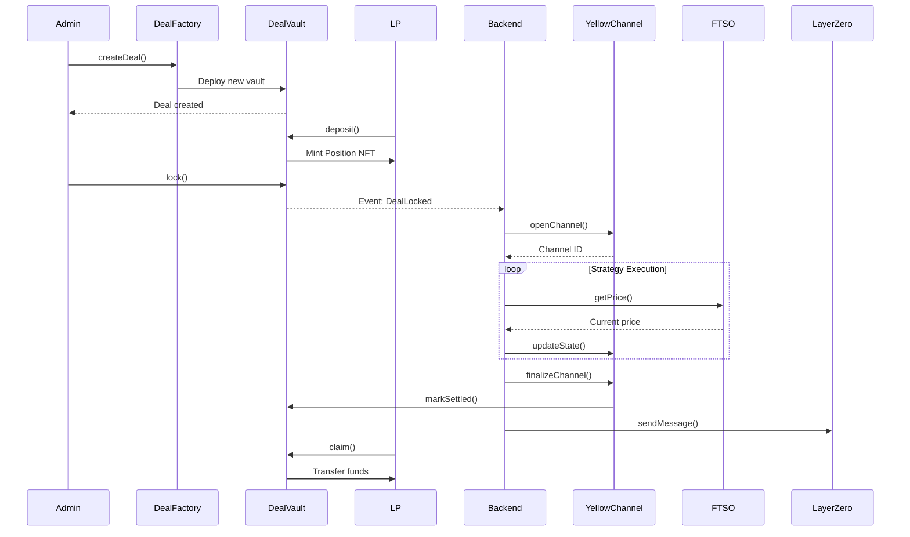

# Liquium - Project Overview

## Executive Summary

**Liquium** is a cross-chain, state-channel-powered platform enabling liquidity providers (LPs) to deposit capital into curated "deal vaults" representing yield farming opportunities and strategies. Built primarily on **Flare Network** with **Yellow's Nitrolite** state channels. 

## Problem Statement

### For Liquidity Providers
- Complex yield farming strategies require deep technical knowledge
- High gas costs make small positions uneconomical
- Lack of transparency in strategy execution
- Difficulty tracking positions across multiple chains

### For Strategy Runners
- Need efficient capital deployment with minimal on-chain costs
- Require trusted price feeds for strategy execution
- Want composability across DeFi protocols and chains
- Need secure state management without constant on-chain transactions

## Solution Architecture

Liquium solves these problems through:

1. **State Channels (Yellow/Nitrolite)**: Off-chain execution with on-chain finality
2. **Trusted Oracles (Flare FTSO)**: Decentralized price feeds
3. **Cross-Chain Messaging (LayerZero)**: Multi-chain coordination
4. **DeFi Integration (1inch)**: Optimal swap routing

## Key Features

### For LPs (End Users)
✅ **Simple Deposits**: One-click stablecoin deposits into curated deals  
✅ **Position NFTs**: ERC-721 tokens representing LP shares  
✅ **Real-time Pricing**: FTSO-powered price feeds  
✅ **Non-Custodial**: Smart contract security, not centralized custody  
✅ **Cross-Chain Visibility**: Track deals across multiple networks  

### For Admins (Via CLI)
✅ **Deal Creation**: Define strategy parameters, caps, and timelines  
✅ **State Channel Management**: Open/close channels via Nitrolite SDK  
✅ **Settlement Control**: Trigger final distribution to LPs  
✅ **Cross-Chain Signaling**: Notify remote chains of deal outcomes  

### Technical Innovations
✅ **Zero Gas Operations**: Off-chain state updates in Yellow channels  
✅ **Block-Latency Oracles**: FTSO v2 updates every ~1.8 seconds  
✅ **Verifiable Finality**: Cryptographic proofs for all state transitions  
✅ **Composable Architecture**: Modular integration with multiple protocols  

## Technology Stack

### Blockchain Layer
- **Primary Chain**: Flare Network (Coston2 testnet)
- **Remote Chain**: Base Sepolia (cross-chain demo)
- **Smart Contracts**: Solidity 0.8.27, Hardhat 3.0

### Protocol Integrations
1. **Yellow (Nitrolite)** - ERC-7824 state channels
2. **Flare** - FTSO v2 price feeds, Secure Random
3. **LayerZero v2** - Cross-chain messaging
4. **1inch** - Swap route optimization
5. **Fluence** (optional) - Decentralized compute
6. **Octav** (optional) - Portfolio analytics
7. **Symbiotic** (optional) - Stake-backed attestations

### Application Layer
- **Backend**: Node.js 22, TypeScript, viem
- **Frontend**: Next.js 15, React 18, wagmi, RainbowKit
- **Infrastructure**: Docker, pnpm workspaces

## User Flows

### LP Journey

```
1. DISCOVER
   ↓
   Browse available deals on Flare
   See: APR, strategy, lockup, capacity
   
2. DEPOSIT
   ↓
   Connect wallet (RainbowKit)
   Approve & deposit stablecoins
   Receive Position NFT
   
3. WAIT (Passive)
   ↓
   Strategy executes off-chain
   View real-time prices (FTSO)
   Track cross-chain status (LayerZero)
   
4. CLAIM
   ↓
   Settlement triggers notification
   Burn Position NFT
   Receive principal + yield
```

### Admin Journey (CLI)

```
1. CREATE DEAL
   $ pnpm cli create-deal --params deal.json
   ↓
   Deploy DealVault on Flare
   
2. FUNDRAISE
   (LPs deposit during window)
   
3. LOCK DEAL
   $ pnpm cli lock-deal --deal-id 1
   ↓
   Open Nitrolite channel
   Deposit capital to AssetHolder
   
4. EXECUTE STRATEGY
   (Off-chain state updates)
   FTSO prices guide decisions
   1inch routes calculated
   
5. SETTLE
   $ pnpm cli settle-deal --deal-id 1
   ↓
   Submit final state to Adjudicator
   Update DealVault with PnL
   Send LayerZero message
   
6. LPs CLAIM
   (Automated via smart contract)
```

## Deal Lifecycle



## Project Structure

```
liquium/
├── contracts/           # Flare smart contracts
│   ├── DealFactory.sol
│   ├── DealVault.sol
│   ├── DealPosition.sol
│   ├── ChannelRegistry.sol
│   └── integrations/
│       ├── FlarePriceReader.sol
│       └── DealMessenger.sol (LayerZero OApp)
│
├── contracts-remote/    # Base Sepolia contracts
│   └── RemoteAccounting.sol
│
├── backend/            # Node.js orchestrator
│   ├── services/
│   │   ├── blockchain/
│   │   ├── channels/
│   │   ├── crosschain/
│   │   └── defi/
│   ├── workflows/
│   └── cli/
│
└── frontend/           # Next.js LP portal
    ├── app/
    │   ├── deals/
    │   ├── positions/
    │   └── analytics/
    └── components/
```

## Success Metrics

### Technical Metrics
- ✅ All contracts deployed and verified on testnet
- ✅ State channel successfully opened and closed
- ✅ Cross-chain message delivered in <5 minutes
- ✅ FTSO price feeds integrated and displaying
- ✅ 1inch quotes fetched and cached
- ✅ Full deposit → execute → claim flow working

### Code Quality Metrics
- ✅ >80% test coverage
- ✅ All linter rules passing
- ✅ Security best practices followed
- ✅ Gas optimizations implemented
- ✅ Clean commit history

## Timeline

### Phase 0: Initialization (Current)
**Duration**: 1 day  
**Goal**: Documentation and structure  
**Status**: 90% complete

### Phase 1: Core MVP (Days 1-2)
**Duration**: 2 days  
**Goal**: Flare + Yellow integration  
**Deliverable**: Working state channel demo

### Phase 2: Cross-Chain (Days 3-4)
**Duration**: 2 days  
**Goal**: LayerZero + 1inch + Frontend  
**Deliverable**: Full user flow functional

### Phase 3: Polish (Days 5-6)
**Duration**: 2 days  
**Goal**: demo  
**Deliverable**: Submission-ready project

**Total Timeline**: 6 days of active development

## Risk Management

### High Priority Mitigations
1. **Yellow Integration**: Study ERC-7824 spec, engage with team early
2. **Time Management**
3. **Testnet Issues**: Have backup chains ready (Arbitrum Sepolia)

### Contingency Plans
- Use mainnet 1inch quotes if testnet unavailable
- Simplify frontend if time-constrained
- Focus on demo quality over feature completeness

## Competitive Advantages

### Technical Innovation
- First to combine state channels + FTSO + LayerZero
- Demonstrates true cross-chain composability
- Production-ready architecture (not just hackathon demo)

### User Experience
- Simple LP interface (no technical knowledge required)
- Real-time price feeds for transparency
- NFT positions for better tracking
- Admin CLI for powerful management

### Protocol Integration
- Deep integration with 4+ protocols
- Extends base contracts (not just inheritance)
- Demonstrates understanding of each protocol
- Provides valuable feedback to sponsors

## Next Steps

### Immediate (This Session)
1. ✅ Complete Memory Bank
2. 🔄 Complete docs/ directory
3. ⏳ Initialize monorepo structure
4. ⏳ Setup environment templates

### This Week
1. Implement smart contracts on Flare
2. Integrate Yellow Nitrolite SDK
3. Build backend orchestrator
4. Deploy initial testnet version

### Next Week
1. Complete cross-chain integration
2. Build and style frontend
3. Write comprehensive tests
4. Record demo video

## Resources

### Documentation
- Product Context: [cline_docs/productContext.md](../cline_docs/productContext.md)
- Architecture: [docs/architecture.md](./architecture.md)
- Technical Spec: [docs/technical-spec.md](./technical-spec.md)
- Implementation: [docs/implementation-roadmap.md](./implementation-roadmap.md)

### External Links
- Yellow/Nitrolite: https://erc7824.org/
- Flare FTSO: https://dev.flare.network/ftso/overview
- LayerZero v2: https://docs.layerzero.network/v2
- 1inch Hackathon: https://hackathon.1inch.community

### Support Channels
- Yellow Discord: TBD
- Flare Discord: TBD
- LayerZero Discord: https://layerzero.network/community
- ETHGlobal Discord: TBD

## Conclusion

Liquium represents a sophisticated integration of cutting-edge blockchain protocols to solve real problems in DeFi. By leveraging state channels for efficiency, decentralized oracles for trust, and cross-chain messaging for composability, the platform demonstrates the future of omnichain applications.

---

**Project Status**: 🟡 Initializing  
**Confidence Level**: 9/10  
**Timeline**: 6 days active development  

*Last Updated: 2025-11-22 01:51 UTC*
